# Maker Portfolio - Josh Piety
## Starblazer games - 3D Video Game for DOS & Windows
I was one of two lead developers on Starblazer and Starblazer II, 3D retro space shooter video games inspired by games like Star Fox. Since the game was designed to run on very old hardware, and through DOS, the game engine had to be custom created. Subsequent versions of the project incorporated more sophisticated graphical and logic techniques, such as using quaternions to model spatial rotation and using pulse-width modulated sound to allow for higher quality audio output.

The first version of Starblazer was written for MS-DOS, and was intended to be a simple 3D space shooter, based off of the [Star Wars 1983 arcade game](https://en.wikipedia.org/wiki/Star_Wars_(1983_video_game)). The player would fly through space and down a tunnel, firing at enemies that approach them, and attempt to survive as long as possible. Although a simple task for a modern game engine running on current hardware, the stated goal of the project was to create a final game that would run on 80386 CPUs running MS-DOS, meaning that 3D graphic code had to be written from the ground up with a focus on performance. Initially, we attempted to create a wireframe rendering engine that rotated and projected points in 3D space before displaying them. 

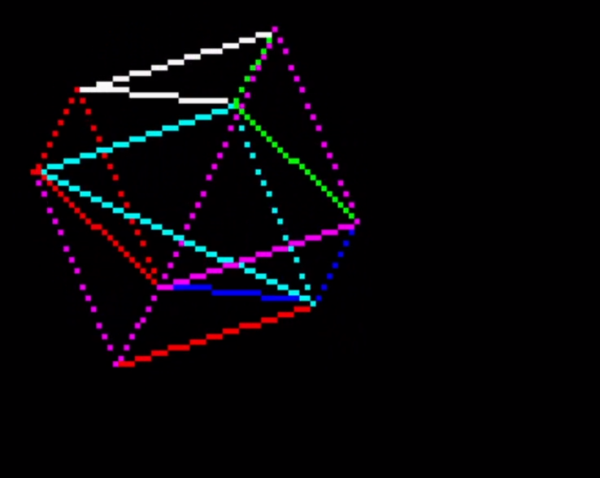

However, the multiple matrix multiplications (as shown below) required to compute the screen locations of 3D points made our implementation of this approach too slow for the target hardware. Additionally, as it was not certain that floating-point hardware would be present on the target machine, floating-point operations had to be performed in software, further reducing speed.

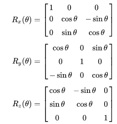

We opted to use "flat" two-dimensional vector sprites for enemies and collectible objects, and scale the coordinates of the 2D vectors as they approached the player to simulate a perspective effect. Due to a fixed viewpoint and thus no rotation calculations, this approach was much faster. The transformed points could be then be connected with a Bresenham line-drawing algorithm.

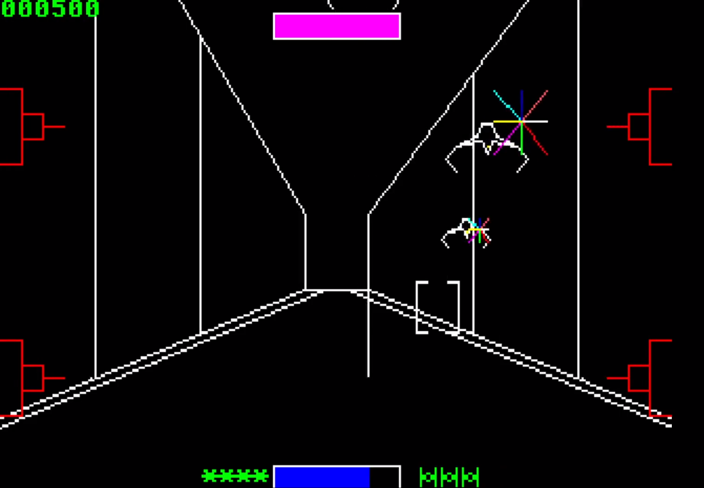

As part of the limited target system hardware, provisions were only included for a single square-wave [PC speaker](https://en.wikipedia.org/wiki/PC_speaker), limiting the potential game music to simple beep and tones. We attempted to circumvent this by pulse-width modulating the speaker's state at a regular interval and produce an approximation of digital audio signals. While this consumed a large amount of CPU execution time repeatedly adjusting the duty cycle, it allowed for more complex sounds - such as a combination of many waveforms - to be emulated on the simple sound hardware. It was even possible to play waveform audio read from a file, although this in practice required too much disk space for the target machine to reasonably handle.

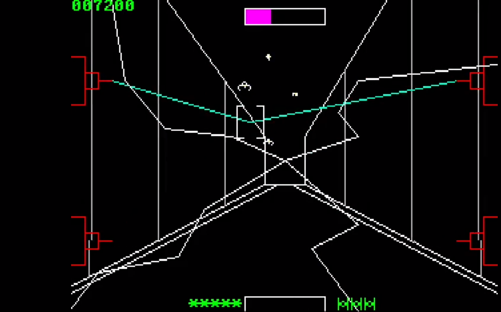

After creating Starblazer, we started on a new project that would eventually become Starblazer II, intending to improve on the limitations we had run into with the first game. The primary goal this time was to move away from 2D scaled vectors into full 3D rendering - as had been difficult previously. There were several techniques used for this:
* 32-bit fixed point numbers proved much easier to perform arithmetic on when lacking a floating point unit. Coordinates were represented as triples of fixed-point numbers with 16 bit integer and fractional parts.
* Inline assembly routines for fixed point math and matrix operations allowed these critical time consumers to be made much faster - for example, this function:
```c
FIXED fixed_mul(FIXED a, FIXED b) {
#ifdef _M_IX86
	__asm{
		mov eax, a
		imul b
		shr eax, 16
		shl edx, 16
		or eax, edx
	}
#else
	return ((int64)a * b) >> 16;
#endif
}
```
* Use of a combined rotation matrix rather than individual matrices for rotation about each axis made the computation much quicker.

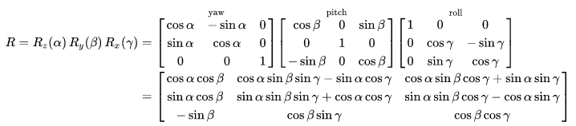

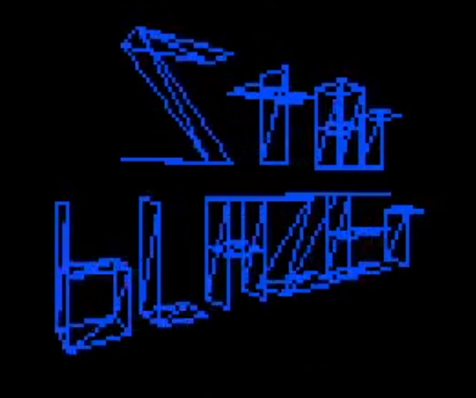

As seen in this image, the 3D graphics we achieved were ultimately entirely wireframed. The camera could rotate through pitch, yaw and roll; this would then rotate all displayed points by the produced rotiation matrix, then project them into the 2D plane of the screen and draw lines between the points of each 3D polygon.

We also experimented with multiplayer functionality that allowed two players to fight each other by connecting machines with a null-modem serial cable and using the serial ports on each computer (obviously rare nowadays, but on the old hardware being targeted this was a common feature). This, of course, required code to handle synchronizing the game state between the two players. Although establishing a stable connection initially was difficult, the serial multiplayer system was eventually developed to the point where it could be used to demo the game to others, by having them play each other in a two-player match.

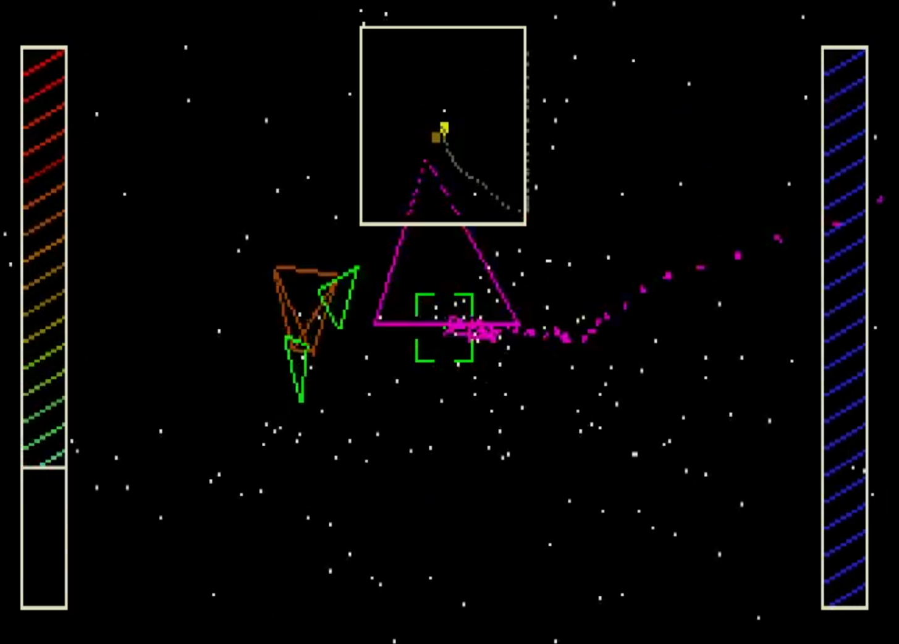

A major flaw with our approach to 3D graphics in general surfaced when we started exploring the dynamics of player motion in the multiplayer version of the game, however. We had used, as mentioned earlier, a triplet of Euler angles (pitch, yaw, roll) to encode the angle that an object, including the player, was facing. Euler angles are susceptible to [gimbal lock](https://en.wikipedia.org/wiki/Gimbal_lock), in which a rotational state is reached where two different angles produce the same effect on an object's orientation.

This made it difficult to freely maneuver the player's spaceship - when they approached either the north or south "pole" of their rotation, a user would have to adjust their controls more and more. This occurs because rotations are applied sequentially - first (for instance) a point is rotated about the z-axis, then the y-axis and finally the x-axis. While the x-axis of rotation is transformed according to the z-axis rotation, the opposite is not true, as matrix multiplication is not commutative. 

Unfortunately, before we could produce a satisfactory solution to this problem, we recognized that our codebase had accumulated more than its fair share of technical debt. We had been uncertain about the development of the game (because we were unsure how to solve certain engineering problems at first), which led to parts of the codebase being constantly updated and changed to support new changes. At last, we decided to rewrite the game using our new experience, but with an emphasis on structure and maintainability. We also incorporated a version control system into managing our code - something that in the past had been lacking, and that had made development more "segmented". The code for this version can be found [at this GitHub link](https://github.com/BHTY/Starblazer-II).

In addition to rewriting the game, we also restructured it to be more modular. More specifically, while the early versions of Starblazer II were entirely platform dependent (that is, required substantial effort to port to Windows or even Linux from DOS), the platform-specific code in the new codebase was sectioned off to a single file. This allowed us to create ports for DOS, modern Windows computers and Linux machines with minimal modification of code. For development, this proved very valuable - modern optimizing compilers like `gcc` and `clang` were available (while they were unable to run through DOS), as were modern debugging tools for Linux such as `gdb` and AddressSanitizer. This was especially important considering I was developing the game under Linux. (Obviously, most users would be expected to use a modern version of Windows to run the game.)

While rewriting the game from the ground up, we hit upon a solution to the gimbal lock problem from earlier - [quaternions for spatial rotation](https://en.wikipedia.org/wiki/Quaternions_and_spatial_rotation). A quaternion is a mathematical object similar to a complex number, but with a vector imaginary part `bi + cj + dk` instead of a scalar `bi`. They also obey the law that `i^2 = j^2 = k^2 = ijk = -1`. 

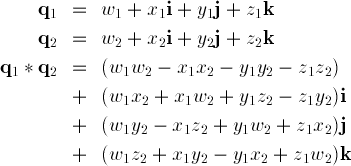

Quaternions of magnitude one - unit quaternions - efficiently (with only 4 variables, as opposed to nine for a rotation matrix) represent 3D spatial rotations. They can also be composed (i.e. multiplied) more efficiently than matrices can, making them perfect to represent a rotation state in a game like Starblazer II. Specifically, each frame of gameplay, the current rotation is stored as a quaternion, and adjusted by a small step - say, 0.1 degrees pitch - based on how the player chooses to rotate their camera. Since only one rotation is performed at once, the ordering problem of gimbal lock is avoided.

We also decided to enhance the game visuals. While [2D triangle fill operations](http://www.sunshine2k.de/coding/java/TriangleRasterization/TriangleRasterization.html) are more time-consuming than simple Bresenham line drawing, it's obviously more visually interesting to see flat-shaded polygonal graphics than simple wireframes. In order to prevent back polygons from drawing over front polygons, we sorted them by z-coordinate relative to the camera and processed them in that order. In order to create a better visual impression of depth, we incorporated a directional [flat-shading](https://en.wikipedia.org/wiki/Shading#Flat_shading) lighting system. In this system, each polygon's color was modified by an illumination level, computed based on the dot product between the normal vector to the polygon and the vector between its center and the camera position.

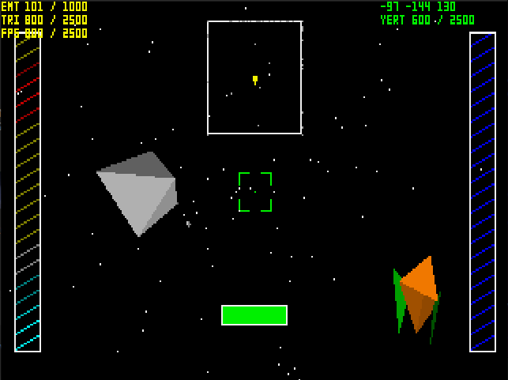

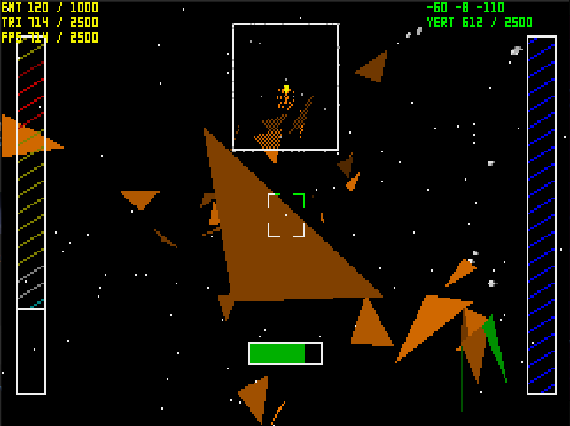

## SuperNova 8000 - Custom 8-bit computer constructed on breadboard and PCB

The SuperNova 8000 (SN8K) is an 8-bit computer, running on a W65C02S-14 processor (a variant of the 6502), alongside 32K of SRAM and 8K of programmable EEPROM. I designed the system architecture myself, as well as assembling it.

For easy prototyping, the first version was built on a breadboard. It incorporated these components:
* W65C02S-14 CPU
* W65C22 VIA (versatile interface adapter) used to communicate with peripherals
* 62256 SRAM chip, 32K
* 28C64B EEPROM chip, used for storing program code
* System clock at 1 MHz
* Discrete logic ICs to manage memory mapping

In order to program the EEPROM, as opposed to purchasing an expensive dedicated programmer, I designed one using an Arduino:


This allowed me to assemble 6502 assembly using `ca65`, flash it to the EEPROM and have it executed on the computer. In order to construct the device, I had to reference [datasheets](https://www.westerndesigncenter.com/wdc/documentation/w65c02s.pdf) on each of the ICs - for instance, this:

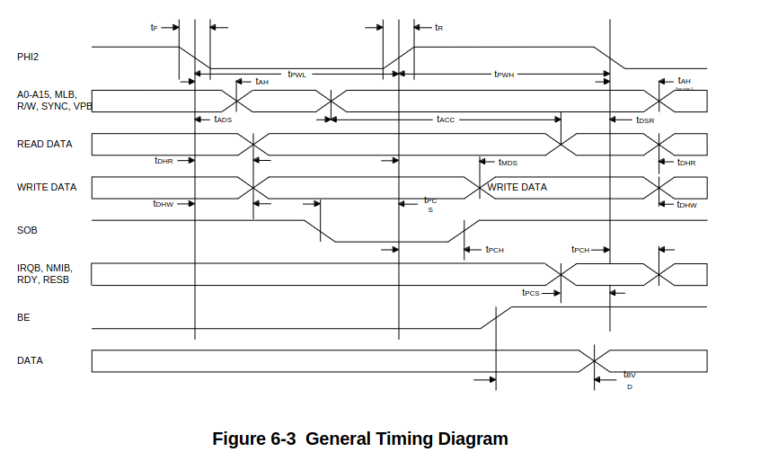

It took a few days to construct and debug the breadboard prototype, but it eventually worked:


The 8-bit register (labeled as "Flip flops") can be accessed by writes to the upper half of memory (addresses `$8000-$FFFF`, where the EEPROM is accessed through reads), and in this case holds the value `$55` that was written through code.

In order to demonstrate that this simple design could perform computation, I wrote a proof-of-concept program that checks if numbers are prime:
```
.segment "ZEROPAGE"
; zp variables here
temp1: .res 1
temp2: .res 1
cur_prime: .res 1
.segment "RAM"
; ram variables here

.segment "ROM"
checkDivisible:
    ; checks if x is divisible by a
    ; returns ff if true and 00 if false
    ; preserves x and y
    ; clobbers a and flags, temp1 and temp2
    stx temp1
    sta temp2
checkDivisible_loop:
    clc
    adc temp2
    cmp temp1
    beq checkDivisible_yes
    bcc checkDivisible_loop
    lda #00
    rts
checkDivisible_yes:
    lda #ff
    rts
isPrime:
    ; checks if x is prime
    ; returns ff if true and 00 if false
    ; preserves x and y
    ; clobbers a and flags, temp1 and temp2
    txa
    and #01
    beq isPrime_odd
isPrime_composite:
    lda #00
    rts
isPrime_odd:
    lda #03
isPrime_loop:
    pha
    jsr checkDivisible
    bne isPrime_composite
    pla
    clc
    adc #02
    stx temp1
    cmp temp1
    bcc isPrime_loop
    lda #ff
    rts
findNextPrime:
    ; finds the next prime after cur_prime and puts it in cur_prime
    ; preserves y
    ; clobbers a, x and flags, temp1 and temp2
findNextPrime_loop:
    inc cur_prime
    ldx cur_prime
    jsr isPrime
    bne findNextPrime_finished
    jmp findNextPrime_loop
findNextPrime_finished:
    rts
nmi:
    jsr findNextPrime
    lda cur_prime
    sta ffff
    rti

irq:
    rti

reset:
    sei
    cld
    ldx #ff
    txs
    lda #02
    sta cur_prime
    sta ffff
endless:
    jmp endless

.segment "VECTORS"
.word nmi
.word reset
.word irq
```

A pushbutton was wired to the NMI pin (pin 6) of the 65C02 microprocessor, and as I signaled it through that button, the program worked as intended - the LED array stepped through all prime numbers between 0 and 255. 

However, the system was prone to wires coming out of the breadboard, so I decided to move future development to a printed circuit board. I used the KiCad EDA tool to design the schematic for the system and the physical PCB design:

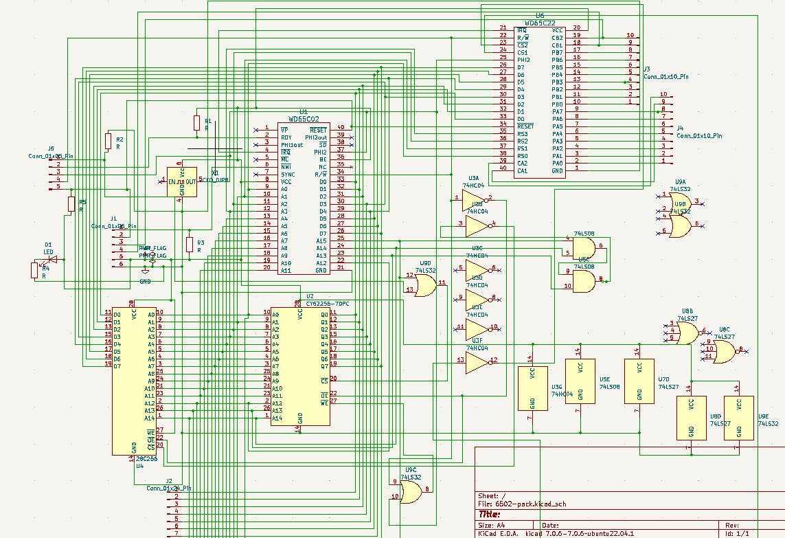

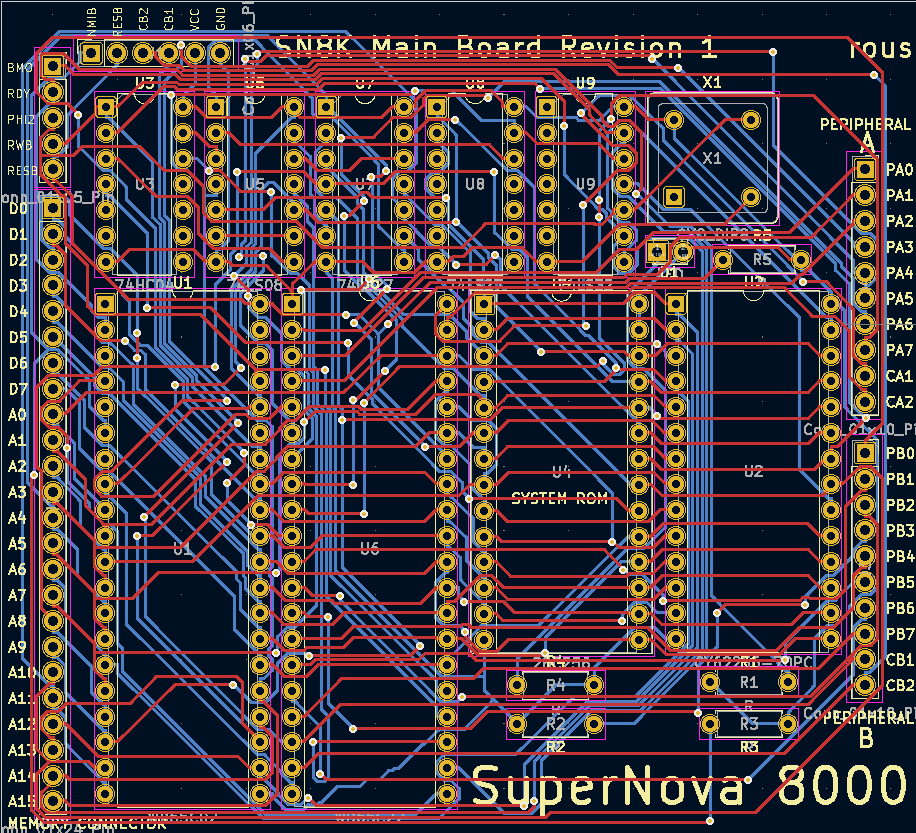

After checking the design, I put in the PCB for fabrication at the fabrication service [OSH Park](https://oshpark.com/). I soldered the components used in the breadboard design into the PCB.


The design mostly worked; however, I had inadvertently mapped the 16 registers used by the VIA into space also mapped by the SRAM chip. If the system read from one of those addresses, it would cause a bus conflict and possibly damage hardware due to overcurrent. This necessitated a second revision (in which I also repositioned some of the connectors):

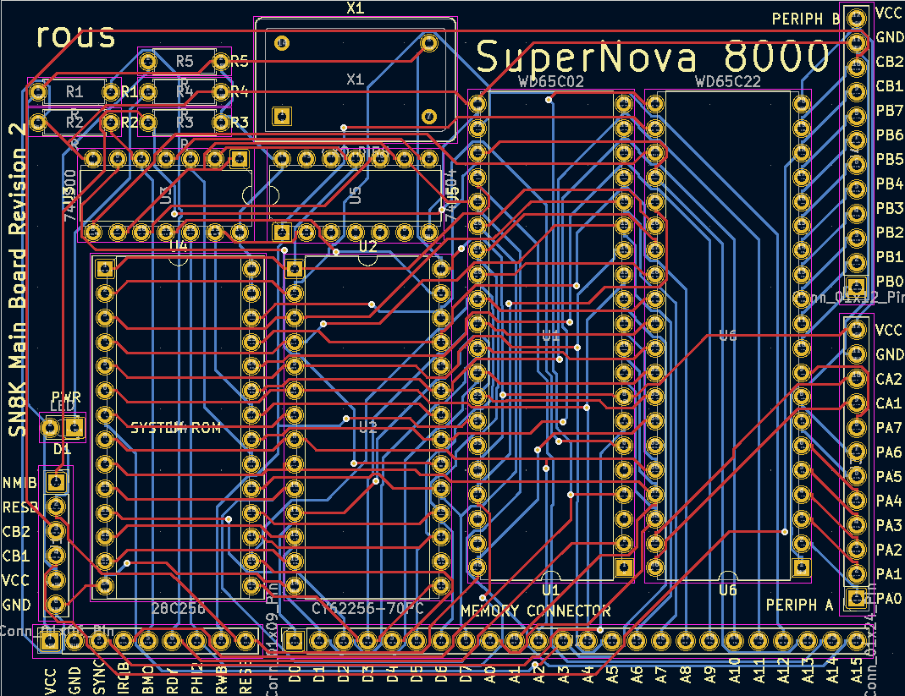

## Brimstone: Game engine for NES for 32KB development

The NES was a video game system that first released in 1983 in Japan. The first games developed for it were limited to 32 kilobytes of code space. I developed a game engine that ran under this same limitation, both to gain an appreciation for the history of computing and learn how to work under constrained environments, like those present in embedded systems. 

The most pressing issue is reducing the space footprint of game level data. If a standard game has 16 levels or stages, each level contains 8 "screens" worth of gameplay, and each screen is 16x16 "tiles", each one represented by a single byte, the game will use `16*8*16*16=32768` bytes for its level data, which leaves no space at all for program code! To get around this, I developed a custom compression algorithm.

Although in a game each level will span many "screens", game objects will:
* Often exist in very similar forms (rectangular blocks, or repeated patterns)
* Exist near each other (locality of reference) and slowly span the available space, as opposed to jumping around

Instead of using 8 bits to store X and Y coordinates for a game object, it is thus feasible to use 4 bits to store each as a signed displacement (-8 to 7) from the last object - a "command pointer" moving around the level keeps track of these positions and is updated by each game object. This means that the X and Y can be packed into a single "position" byte for each game object:

```
Position
XXXXYYYY
||||++++- signed Y offset
++++----- signed X offset
```

Each game object exists as one of the following types, including a two bit header and a six bit value:
```
Header byte
TTAAAAAA
||++++++- value/argument
++------- type field
```
The four/five types are:
* Type `00`: point. Some objects such as triggers only occupy a single point in space. The argument specifies what kind of object is placed here; there is a position byte following the header.
* Type `01a`: dynamic rectangle. This is a "catch-all" for more unique game objects that don't compress well as a series of rectangles, but take up a rectangular area. The argument field is left as zero, and is followed by a position byte and a size byte (with 4 bits apiece to width and height). After this is the content of the rectangular area: one byte per tile.
* Type `01b`: quick movement. Since displacements are from -8 to 7, moving, for instance, 15 tiles in one step between objects is impossible. If the argument field of a type `01` object isn't left as zero, each 3-bit half is interpreted as a signed displacement that's multiplied by 16 before being used to offset the "command pointer".
* Type `10`: static rectangle. Many game objects, like walls, background and floors, are comprised of the same tile repeated in a rectangular area. The argument field specified what kind of tile, and is followed by a position byte and a size byte.
* Type `11`: pattern playback. Often, the same object will show up many times. A list of "patterns", each being a compressed command sequence like this (essentially a subroutine), is included with the level data. The argument field specifies which pattern should be played back. It's followed by a position byte and a size byte - the width and height are interpreted as the number of times to loop the pattern in each axis.

In order to create the levels, I developed a GUI tool that supported this format natively:

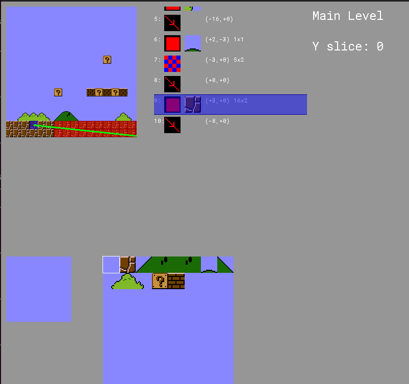

With that done, I looked to developing other components of the game engine:
* Since the level data was stored compressed, decompression must happen at runtime on a very slow system, which also necessitated a very optimized decompression algorithm.
* The majority of the game code was written in [Millfork](https://github.com/KarolS/millfork), a new "middle-level" language specifically designed for this application. It was much more convenient than assembly language without sacrificing control over low-level parameters like memory layout, which on a constrained system is crucial. At the time I started this project, there were no good C compiler toolchains for this architecture. Components like decompression and frequently used macros were written in assembly.
* Video memory (VRAM) can only be accessed during the short time at the beginning and end of each frame when the video chip is not using it to draw to the screen ("vblank"). This meant I had to precompute the "updates" that needed to be made to the screen as the player moved through a level and uncovered new objects. As soon as this window of time started, the updates could be put into place.
* Since the hardware lacked any floating-point support, fixed point numbers of varying precision were used to implement physics and object collision detection.
* To save on processing power, a distinction in code was made between dynamic game entities that move and perform actions (termed "enemies") and static game objects that display a visual for a period of time (termed "effects"). That way, movement and collision detection routines aren't executed for these static objects.

The final engine uses about 8 kilobytes of space. This leaves the remaining 24 kilobytes for a prospective game and its data and objects. Of the available 2 kilobytes of RAM in the system, this engine uses about half of it, once again leaving the remainder for any game that leverages the engine.

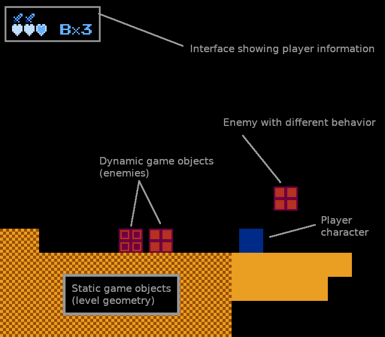

The development, and debugging, of the game engine, was supported greatly by the development tools of the NES emulator, in this case a program called Mesen, that was used to test the engine. Mesen supplies a large amount of debug/technical information that can be used to analyze program behavior and optimize performance. While the underlying system is obviously quite different, this information is presented in a structure very similar to that presented by modern analysis tools, such as `gdb` or `gprof`:

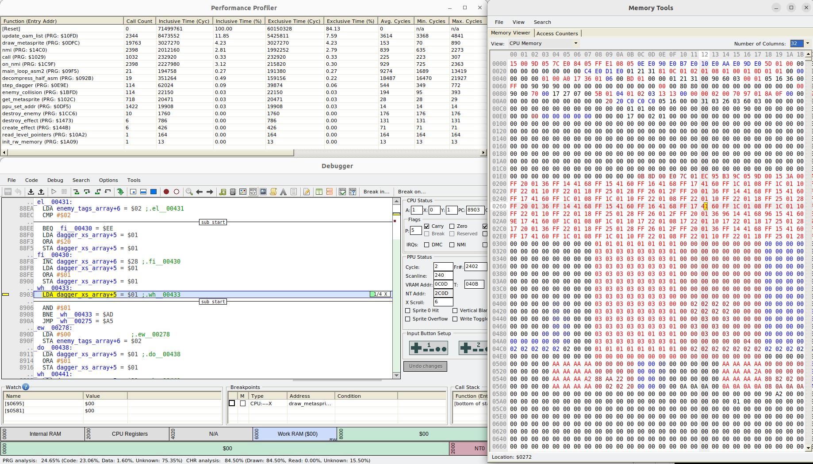

## SNES Hardware Repair Project

After I received a non-functional Super Nintendo Entertainment System (video game console) from a friend, I set out to use my technical knowledge to repair it. The workings of the system are extensively documented, as are the games that run on it, so this was feasible.

When I initially tried to load a game using it - in this case, the 1994 game *Donkey Kong Country* - I was met with only a black screen, which could imply a catastrophic failure that can't be recovered. For instance, fried components might not exist on the market anymore, and transistor level damage is completely impossible to repair. However, given that the system had worked previously, I wanted to look further into it. Sure enough, the related *Donkey Kong Country 2* gave me different results:

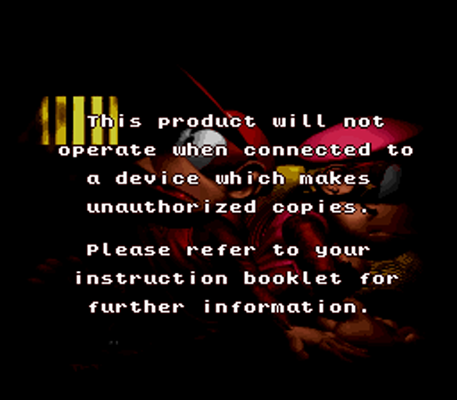

Clearly, the CPU, RAM and graphics hardware have at least minimal functionality, and no essential components are totally destroyed. The conditions under which this "anti-piracy" screen is displayed can be found from a [disassembly of the game](https://github.com/p4plus2/DKC2-disassembly/tree/master): 
```
	REP #$20                    ;$808436   |\ Test that SRAM is present
	LDA.l sram_base	            ;$808438   | |
	INC A			            ;$80843C   | |
	STA.l sram_base	            ;$80843D   | |
	CMP.l sram_base				;$808441   | |
	BNE .prepare_anti_piracy	;$808445   |/ Otherwise trigger anti piracy
	DEC A					    ;$808447   |\ Restore byte modified
	STA.l sram_base				;$808448   |/
```
One of these conditions is that the save data RAM chip (SRAM) is present. The save data memory area is located at memory address `$B06000`, while the code above is located around memory address `$808436`. Therefore, a hardware fault in the upper address pins A22-A20 would allow code at `$808436` to execute, while accesses to memory at `$B06000` fail. Testing this hypothesis, I removed and cleaned the [cartridge connector](https://snes.nesdev.org/wiki/Cartridge_connector) (the adapter that the game uses to communicate with the console), and used a continuity tester to confirm that all pins were functional.

Unfortunately, this did not solve the problem. I attempted to use electrical tape to "mask" off pins on the connector to determine if a fault in any of these pins (here simulated using the electrical tape) resulted in the same effect as I observed, but it became clear that the issue was not a simple continuity issue, but instead something more difficult to resolve.

The next step was to observe the workings of the system at a CPU level and note any discrepancies. To this end, I purchased a logic analyzer - essentially an oscilloscope specifically intended for measuring 5V logic signals. Wires connected to the logic analyzer could be held in place by pressure from the connector, allowing me to "hook in" to the communication between the game and console:


I could now record the bytes that were being read, written and executed by the CPU (more specifically, a 65816 running at 3.58MHz) by logging the contents of the address bus. The logic analyzer was limited to eight digital channels, while the system had 24 address pins, 8 data pins and several other control signals that were necessary for discerning the operation of the CPU - clock and read/write signals, for instance. Thus, it was necessary to record data over several runs and match it up:

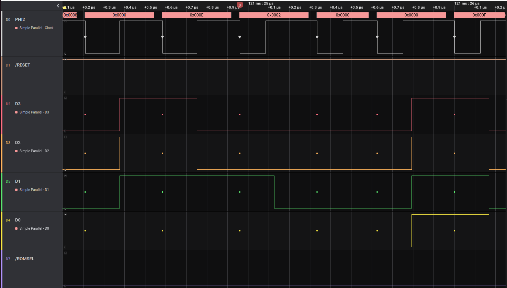

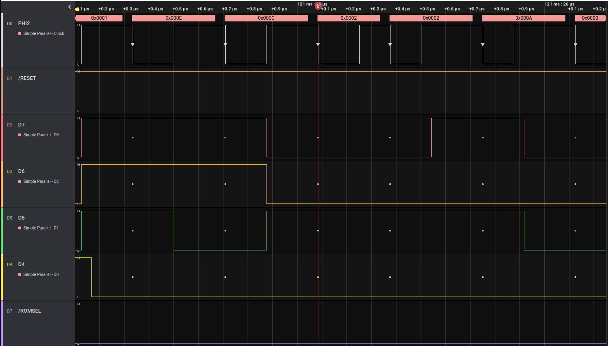

I determined that at 121.024958 milliseconds after the RESET button was released, a given code sequence reliably executes, and I began my analysis there.
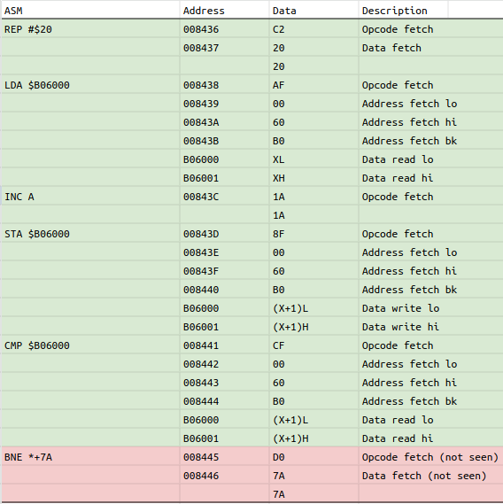

As was determined from the logic analyzer traces (green cells in the listing representing bus values that were confirmed by the logic analyzer), the CPU executes up to the `CMP.l sram_base` instruction detailed above without any irregularities. The values read from memory are consistent with bytes that would cause the `BNE` to *not* be taken - that is, the piracy check passing and the game starting.
At that point, inspection of the trace doesn't show the CPU executing the `BNE` instruction yet. A period of a few CPU cycles passes where the bus contents aren't well defined, but contain spikes shorter than 1 CPU cycle such as these (which were also occasionally observed earlier):

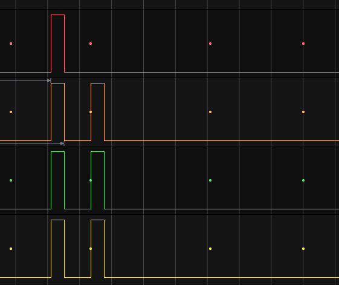

After this period of time, the CPU resumes execution consistent with the `BNE` *being taken*. Thus, either the values read from memory were corrupted somehow, or during this anomalous period, the register/flag contents were changed.
